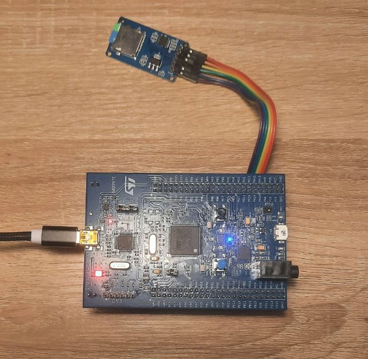

# Custom bootloader
This project is a custom bootloader that, at startup, checks if the user pressed a pushbutton. If the button is pressed, the bootloader reads a HEX file from the SD card, parses it, and updates the user application. If the button is not pressed, it directly jumps to and runs the existing user application.

## Contents

- [Custom bootloader](#Custom-bootloader)
  - [Contents](#Contents)
  - [Hardware](#Hardware)
  - [Bootloader](#Bootloader)
    - [Overview](#Overview)
    - [HEX parser](#HEX-parser)
    - [Jump to user application](#Jump-to-user-application)
  - [User Application](#User-Application)

## Hardware

The bootloader is written for the STM32F407 Discovery board, and it uses the board’s built-in user pushbutton to check whether the user wants to update the application from external memory. Since this board does not have an onboard SD card slot, an external SD card module is connected through SPI. The STM32F407 pins used to interface with the SD card are:

- **CS   → PA4**
- **SCK  → PA5**
- **MISO → PA6**
- **MOSI → PA7**

<p align="center">
  
</p>

## Bootloader

### Overview
The bootloader is an application that runs before the user application, and it can have different purposes. In this project, it is used to update the firmware from an SD card. It is activated by a pushbutton on the hardware. If the pushbutton is pressed at startup, the bootloader looks for a user application HEX file on the SD card, reads it, parses it line by line, and writes the data into the microcontroller’s flash memory. After the update is complete, the bootloader jumps to the user application. The following sections explain the HEX parser and the jump-to-application process. The bootloader source code can be found in the [`Bootloader`](Bootloader/) directory.

### HEX Parser

The HEX parser reads the Intel HEX file line by line and converts each line into binary data that can be written to flash memory. Every HEX line follows this format:
```
:LLAAAATTCC
```

Where:
- **LL** – number of data bytes  
- **AAAA** – 16-bit address offset  
- **TT** – record type  
- **DATA** – actual payload bytes  
- **CC** – checksum byte  

#### HEX Parser Example

Example HEX file used for updating:

```
:020000040800F2
:10C000000000022021C700089DC60008A5C6000840
:10C01000ADC60008B5C60008BDC600080000000097
:10C02000000000000000000000000000C5C600087D
```

**Step-by-Step Parsing:**

1. **`:020000040800F2`**  
   - Record Type: **04** (Extended Linear Address)  
   - Data: `08 00`  
   - Base address becomes:  
     ```
     BaseAddress = 0x08000000
     ```

2. **`:10C00000...`**  
   - Record Type: **00** (Data)  
   - Offset: `0xC000`  
   - Full flash address:  
     ```
     0x0800C000
     ```  
   - Bootloader writes 16 bytes starting here.

3. **`:10C01000...`**  
   - Full flash address: `0x0800C010`  
   - Writes the next 16 bytes.

4. **`:10C02000...`**  
   - Full flash address: `0x0800C020`  
   - Writes the next 16 bytes.

The parser continues until it encounters the End-Of-File record, which is identified by record type **01** (for example: `:00000001FF`). When this record is detected, the parser stops reading the file and the bootloader proceeds to the next step. Each line is validated with its **checksum** before writing data to flash memory.

---

### Jump to User Application

Once the firmware update is completed or if the update mode is not triggered the bootloader transfers execution to the user application.  
This process includes:

1. **Disabling interrupts**
2. **Stopping SysTick**
3. **Resetting clock configuration**
4. **Clearing and disabling NVIC interrupts**
5. **Loading the user application’s initial stack pointer from the begining of the user application**
6. **Setting the Vector Table Offset Register (VTOR) to point to the user application**
7. **Jumping to the Reset_Handler of the user application**

## User Application

The user application used for testing in this project is a simple LED blink program, located in the [`Application`](Application/) folder. Since the bootloader occupies the beginning of the flash memory, the user application must be placed after the bootloader region. To do this, the linker script of the user application must be modified so that its start address matches the application base address.

In STM32 projects, this is done by editing the `.ld` file generated by STM32CubeIDE. For example, in this project you can modify the start address in the linker script located at  
[`Application/STM32F407VGTX_FLASH.ld`](Application/STM32F407VGTX_FLASH.ld), line 50, to set the correct base address for the application.
